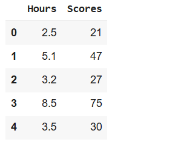
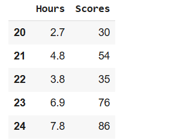
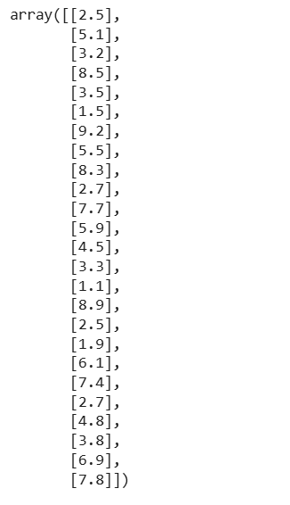
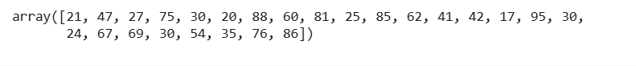
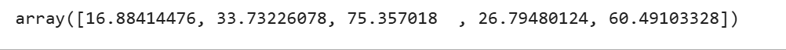
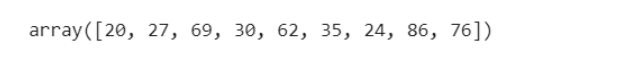
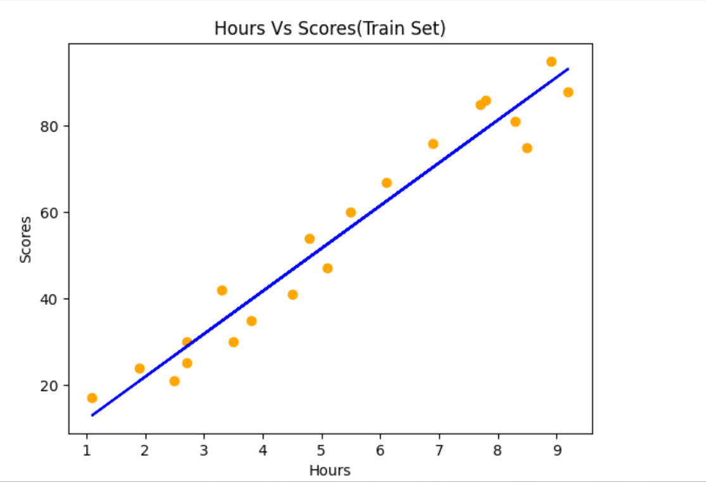
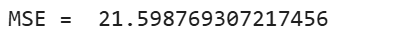
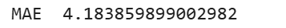
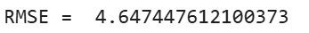

# Implementation-of-Simple-Linear-Regression-Model-for-Predicting-the-Marks-Scored

## AIM:
To write a program to predict the marks scored by a student using the simple linear regression model.

## Equipments Required:
1. Hardware – PCs
2. Anaconda – Python 3.7 Installation / Jupyter notebook

## Algorithm
1.Import the required libraries and read the dataframe.

2.Set variables for assigning dataset values.

3.Import linear regression from sklearn.

4.Assign the points for representing in the graph.

5.Predict the regression for marks by using the representation of the graph.

6.Compare the graphs and hence we obtained the linear regression for the given datas. 


## Program:
```
/*
Program to implement the simple linear regression model for predicting the marks scored.
Developed by: DIVYA E
RegisterNumber:  212223230050
*/


import pandas as pd
import numpy as np
import matplotlib.pyplot as plt
from sklearn.metrics import mean_absolute_error,mean_squared_error
df=pd.read_csv('/content/student_scores.csv')

df.head()

df.tail()

#Array value of X
X=df.iloc[:,:-1].values
X

#Array value of Y
Y=df.iloc[:,1].values
Y

#splitting train and test data
from sklearn.model_selection import train_test_split
X_train,X_test,Y_train,Y_test=train_test_split(X,Y,test_size=1/3,random_state=0)

from sklearn.linear_model import LinearRegression
regressor=LinearRegression()
regressor.fit(X_train,Y_train)
Y_pred=regressor.predict(X_test)

#displaying predicted values
Y_pred

#displaying actual values
Y_test

#graph plot for training data
plt.scatter(X_train,Y_train,color="orange")
plt.plot(X_train,regressor.predict(X_train),color="blue")
plt.title("Hours Vs Scores(Train Set)")
plt.xlabel("Hours")
plt.ylabel("Scores")
plt.show()

#graph plot for test data
plt.scatter(X_test,Y_test,color="purple")
plt.plot(X_test,regressor.predict(X_test),color="yellow")
plt.title("Hours Vs Scores(Test Set)")
plt.xlabel("Hours")
plt.ylabel("Scores")
plt.show()

mse=mean_squared_error(Y_test,Y_pred)
print('MSE = ',mse)

mae=mean_absolute_error(Y_test,Y_pred)
print('MAE ',mae)

rmse=np.sqrt(mse)
print("RMSE = ",rmse)
```

## Output:
df.head()



df.tail()



Array Values of X



Array values of Y 



Values of Y prediction



Array values of Y test



Training Set Graph



Training Set Graph


Values of MSE, MAE and RMSE





## Result:
Thus the program to implement the simple linear regression model for predicting the marks scored is written and verified using python programming.
